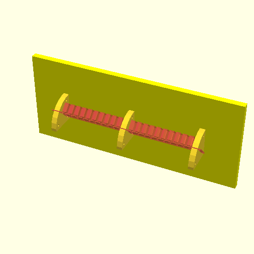

# USB Hanger

** **Incomplete project - Abandoned in favor of PCB based [USB Holder](https://github.com/PhilboBaggins/usb-holder) project.** **

A silly way to hang USB cables on a wall. Designed to be laser cut.

The holders will be stuck to a wall with something like [3M Command Large Adhesive Picture Hanging Strips](https://www.bunnings.com.au/command-large-white-adhesive-picture-hanging-strips-4-pack_p3950291) and the panel slotted into them. The picture hanging strips are 19 mm wide, while most materials you'd laser cut are thinner than that, so the holders have been designed with screw holes through them so that multiple holders can be bolted together to make up the desired thickness (18 mm in the current design).

..... something about panel mount USB cables ..... like the ones left over from RTD IDAN systems....

I think I'll use these materials:

* Panel: 3mm [Glass Green Acrylic](https://www.ponoko.com/materials/glass-green-acrylic)
* Holder: (3 x 3) 6mm [Macrocarpa Hardwood](https://www.ponoko.com/materials/macrocarpa-hardwood)

